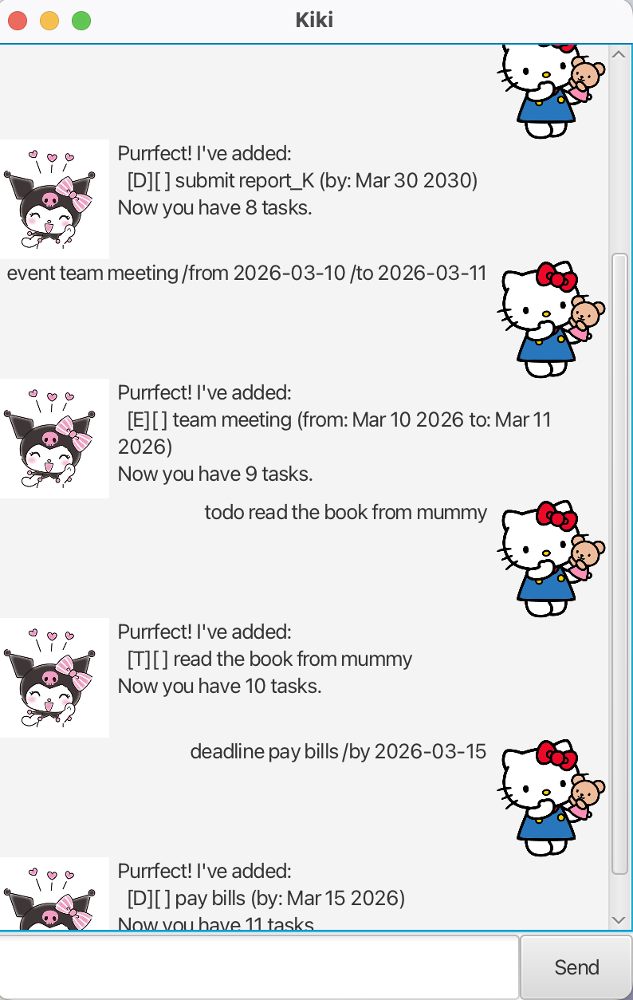

# Kiki User Guide 🐱



Kiki is a cute cat-themed task manager chatbot that helps you keep track of your todos, deadlines, and events. Kiki is optimized for fast typists who prefer a keyboard-driven interface. Nyaa~ ฅ^•ﻌ•^ฅ

## Quick Start
1. Download the latest `kiki.jar` from the releases page.
2. Open a terminal and navigate to the folder containing the jar file.
3. Run `java -jar kiki.jar` to start the app.
4. Type commands in the input box and press **Send** or **Enter**.

---

## Features

### Adding a Todo: `todo`
Adds a simple task without any date.

Format: `todo <description>`

Example: `todo buy cat food`
```
Purrfect! I've added:
  [T][ ] buy cat food
Now you have 1 tasks. Nyaa~
```

### Adding a Deadline: `deadline`
Adds a task with a due date.

Format: `deadline <description> /by yyyy-mm-dd`

Example: `deadline submit report /by 2026-03-10`
```
Purrfect! I've added:
  [D][ ] submit report (by: Mar 10 2026)
Now you have 2 tasks. Nyaa~
```

### Adding an Event: `event`
Adds a task with a start and end date.

Format: `event <description> /from yyyy-mm-dd /to yyyy-mm-dd`

Example: `event team meeting /from 2026-03-10 /to 2026-03-11`
```
Purrfect! I've added:
  [E][ ] team meeting (from: Mar 10 2026 to: Mar 11 2026)
Now you have 3 tasks. Nyaa~
```

### Listing all tasks: `list`
Shows all tasks in your list.

Format: `list`
```
1. [T][ ] buy cat food
2. [D][ ] submit report (by: Mar 10 2026)
3. [E][ ] team meeting (from: Mar 10 2026 to: Mar 11 2026)
```

### Finding tasks: `find`
Finds tasks whose description contains the given keyword.

Format: `find <keyword>`

Example: `find report`
```
Here are the matching tasks~ ฅ^•ﻌ•^ฅ
1. [D][ ] submit report (by: Mar 10 2026)
```

### Filtering tasks: `filter`
Filters tasks by type or completion status.

Format: `filter <criteria>`

Supported criteria: `todo`, `deadline`, `event`, `done`, `undone`

Example: `filter deadline`
```
Here are the filtered tasks~ ฅ^•ﻌ•^ฅ
1. [D][ ] submit report (by: Mar 10 2026)
```

### Deleting a task: `delete`
Deletes a task from the list.

Format: `delete <task number>`

Example: `delete 1`
```
Noted. I've removed:
  [T][ ] buy cat food
Now you have 2 tasks. Nyaa~
```

### Exiting the app: `bye`
Says goodbye and closes the app.

Format: `bye`
```
Bye bye~ See you soon! (=^･ω･^=)
- K i k i
```

---

## Command Summary

| Command | Format |
|---|---|
| todo | `todo <description>` |
| deadline | `deadline <description> /by yyyy-mm-dd` |
| event | `event <description> /from yyyy-mm-dd /to yyyy-mm-dd` |
| list | `list` |
| find | `find <keyword>` |
| filter | `filter <criteria>` |
| delete | `delete <task number>` |
| bye | `bye` |